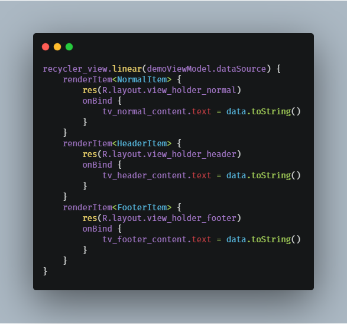

[](https://jitpack.io/#ssseasonnn/Yasha)

*Read this in other languages: [中文](README.zh.md), [English](README.md), [Changelog](CHANGELOG.md)*

# Yasha



> Item introduction：
>
> Kotlin-based modern RecyclerView rendering weapon
> 
> Item Features:
> - No Adapter required
> - No ViewHolder required
> - Support for initial data loading
> - Support data paging loading
> - Support for MultiViewType
> - Support for Header and Footer
> - Support DiffUtil
> - Support Loading State
> - Support CleanUp, free resources to avoid memory leaks

## Prepare

1. Add jitpack to build.gradle
```gradle
allprojects {
    repositories {
        ...
        maven { url 'https://jitpack.io' }
    }
}
```

2.  Add dependency

```gradle
dependencies {
	implementation 'com.github.ssseasonnn:Yasha:1.0.8'
}
```


## First Blood

How to quickly render a RecyclerView? Still tirelessly writing Adapter, ViewHolder? Let Yasha come to save you:

   ```kotlin

     //Render a list with ** dataSource ** as the data source
     recycler_view.linear(dataSource) {

         //Render an Item of type NormalItem
         renderItem<NormalItem> {
             //layout res
             res(R.layout.view_holder_normal)

             //bind data 
             onBind {
                 tv_normal_content.text = data.toString()
             }
         }

         //Render an Header of type HeaderItem
         renderItem<HeaderItem> {
             //layout res
             res(R.layout.view_holder_header)

             //bind data 
             onBind {
                 tv_header_content.text = data.toString()
             }
         }

         //Render an Footer of type FooterItem
         renderItem<FooterItem> {

             //layout res
             res(R.layout.view_holder_footer)

             //bind data 
             onBind {
                 tv_footer_content.text = data.toString()
             }
         }
     }
   ```

As you can see, it's very simple and intuitive, and you don't see any Adapter or ViewHolder. Equipped with Yasha, go to Gank!

## Double Kill

Rendering is done. Where does the data source come from? Yasha thoughtfully prepared a good partner for you：[Sange](https://github.com/ssseasonnn/Sange)

Sange is another powerful weapon. It can provide any data that Yasha needs. With it, Yasha can be like a fish. As in Dota, they are also inseparable. Friends who are familiar with Dota know that Yasha + Sange = Dark Night The sword is the same here. With both of them, why fear any headwinds?

```kotlin
//Create a DataSource
class DemoDataSource : YashaDataSource() {
   
    //loadInitial is responsible for loading list initialization data
    override fun loadInitial(loadCallback: LoadCallback<YashaItem>) {
        
        //Simulate the delay, don't worry, this method will be executed in an asynchronous thread, so you can rest assured to make network requests or database loading, etc.
        Thread.sleep(1500)

        val allDataList = mutableListOf<YashaItem>()

        //Add Headers data
        for (i in 0 until 2) {
            allDataList.add(HeaderItem(i))
        }
        //Add Items data
        for (i in 0 until 10) {
            allDataList.add(NormalItem(i))
        }
        //Add Footers data
        for (i in 0 until 2) {
            allDataList.add(FooterItem(i))
        }

        //Notify data loading is complete
        loadCallback.setResult(allDataList)
    }

    //loadAfter is responsible for loading the next page of data. Yasha will decide whether to trigger pagination loading by itself. You only need to do the logic to load the next page. Leave the rest to Yasha
    override fun loadAfter(loadCallback: LoadCallback<YashaItem>) {
       
        //when loading failed:
        if (page % 3 == 0) {

            //When data loading fails, you only need to simply tell Yasha a NULL value, and Yasha will automatically stop loading and display a status of loading failure.
            loadCallback.setResult(null)
            return
        }

        //when loading finished:
        if(page == 5) {
            //After the data is loaded, you only need to tell Yasha an empty list, and Yasha will automatically stop loading and display a loading status.            loadCallback.setResult(emptyList())
            return
        }

        //Load the next page of data:
        val items = mutableListOf<YashaItem>()
        for (i in page * 10 until (page + 1) * 10) {
            items.add(NormalItem(i))
        }

        loadCallback.setResult(items)
    }
}
```

Is it easy? That's right, the API provided by Yasha and Sange is simple and easy to understand. It can be quickly used without any threshold. It is an essential weapon for traveling at home and killing more goods!

In addition, Sange also provides many APIs for directly operating data sources, such as

```kotlin
//Headers
fun addHeader(t: T, position: Int = -1, delay: Boolean = false)
fun addHeaders(list: List<T>, position: Int = -1, delay: Boolean = false) 
fun removeHeader(t: T, delay: Boolean = false) 
fun setHeader(old: T, new: T, delay: Boolean = false)
fun getHeader(position: Int): T
fun clearHeader(delay: Boolean = false)

//Footers
fun addFooter(t: T, position: Int = -1, delay: Boolean = false)
fun addFooters(list: List<T>, position: Int = -1, delay: Boolean = false) 
fun removeFooter(t: T, delay: Boolean = false) 
fun setFooter(old: T, new: T, delay: Boolean = false)
fun getFooter(position: Int): T
fun clearFooter(delay: Boolean = false)

//Items
fun addItem(t: T, position: Int = -1, delay: Boolean = false)
fun addItems(list: List<T>, position: Int = -1, delay: Boolean = false) 
fun removeItem(t: T, delay: Boolean = false) 
fun setItem(old: T, new: T, delay: Boolean = false)
fun getItem(position: Int): T
fun clearItem(delay: Boolean = false)

//...
```

## Triple Kill

In addition, Yasha also prepared the status display for the younger friends, such as commonly used ** Loading **, ** Loading failed **, ** Loading completed **

If there is any dissatisfaction with the state that comes with it, it is very simple. The first method is to kill it. The second method is to replace it.

```kotlin
//kill it：
class DemoDataSource : YashaDataSource() {

    override fun onStateChanged(newState: Int) {
        //super.onStateChanged(newState)
        //You just need to redo this method and comment out the call to super, so there is no status display!
    }
}

//replace it：
recycler_view.linear(dataSource) {

    //Replace with your own state rendering
    renderItem<YashaStateItem> {
        //new state layout res
        res(R.layout.your_state_view)

        //new state bind
        onBind {
            
        }
        gridSpanSize(spanCount)
        staggerFullSpan(true)
    }
}
```

## Radiant wins, GG

    
## License

> ```
> Copyright 2019 Season.Zlc
>
> Licensed under the Apache License, Version 2.0 (the "License");
> you may not use this file except in compliance with the License.
> You may obtain a copy of the License at
>
>    http://www.apache.org/licenses/LICENSE-2.0
>
> Unless required by applicable law or agreed to in writing, software
> distributed under the License is distributed on an "AS IS" BASIS,
> WITHOUT WARRANTIES OR CONDITIONS OF ANY KIND, either express or implied.
> See the License for the specific language governing permissions and
> limitations under the License.
> ```
